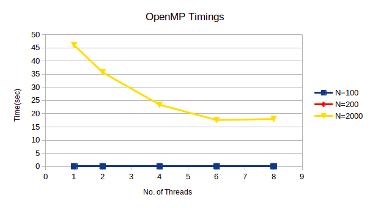
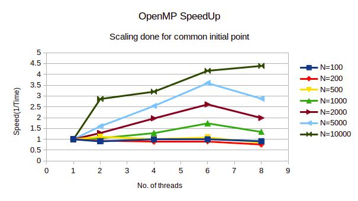
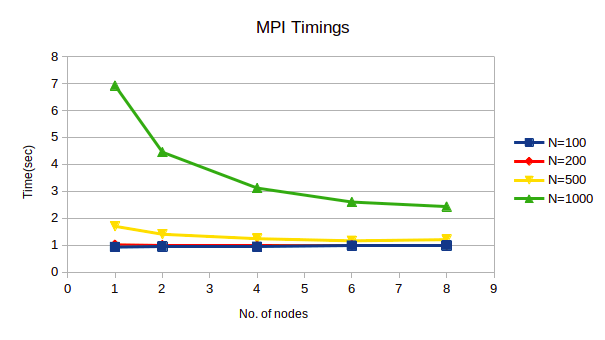
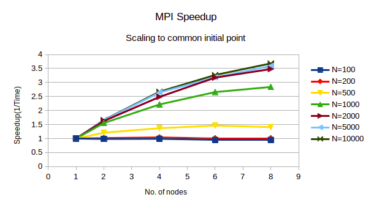
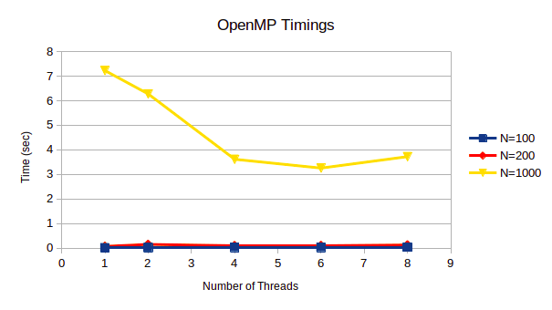
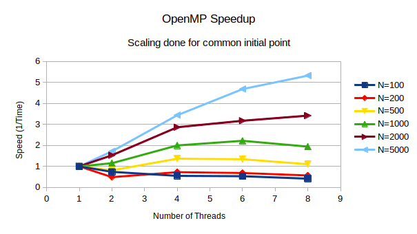
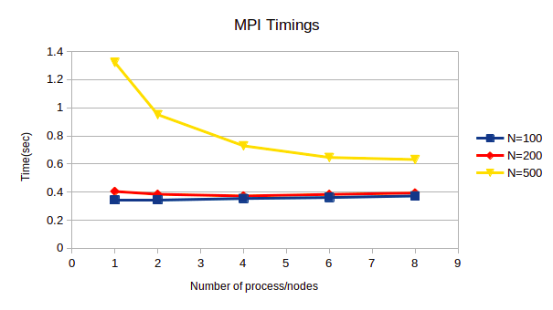
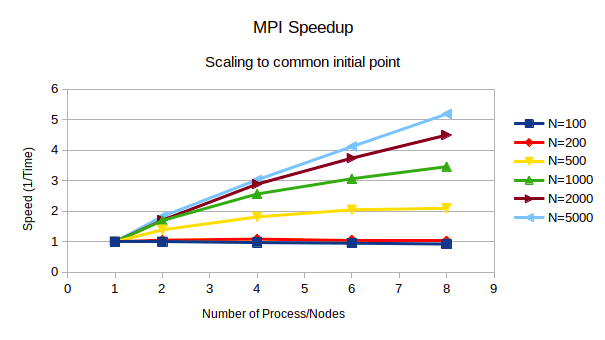

## Computing C = A×B & Transforming C to upper Δ

6th April 2021  

OVERVIEW  

```
Creating two matrices, A and B, each of size (N ×N). Initialising the matrices to random floating
point numbers.  
Writing anOpenMP and MPIcode for computing C = A×Band then transforming C into an upper
triangular matrix. Reporting the times taken for thecodes by varying the size of the problem from
N = 100... 10000. Varying the number for MPI processand OpenMP threads from 2 to 8 on a
single desktop  

```

OpenMP Parallelisation  

Algorithm

```
● Allocate dynamic memory using malloc() with the size(N × N ×size of float) for A (mat1) , B
(mat2) and C (mul).
● Initialize random floating numbers in each parallelthread with seed which is a
combination of current time from the current threadnumber.
● Multiply matrices using three loops i.e O(n^3 ) andparallelised with#pragma omp parallel
shared (matrices) private (loop variables)command.Thus, splitting for-loops
independently amongst threads. Using ikj loop sequenceover usual ijk because of
caching advantages.
● Using row transformation technique to transform amatrix to upper triangle where three
for loops are spawned. Outermost loop represents thenumber of selected columns which
are transformed to zero. Penultimate loop iteratesthe rows and ultimate for-loop iterates
the column and thus each element.
● Basic operation is like, Ri￫ Ri+ λ × Rj, where i and j are as per row transformation for
triangularisation
● Outmost loop can’t be parallelised. So, dividing thepenultimate loop of rows, thus
sections of rows and corresponding column elementsare solved on threads parallely
using #pragma omp parallel for private( row, column,λ).
● Display matrices and results for N<10 to check forlogic correctness.
Observations
The results of time taken to compute C = A×B and transformingC to upper triangle matrix for
OpenMP parallelisation are reported in the table below.The time reported is “real time”. The
actual real-time spent in running the process fromstart to finish as if it was measured by a human
with a stopwatch by its definition.


```
Conclusions

```
● As the dimension of matrices increases, the time tocompute increases as shown in the
table-1 and figure 1.
● As the dimension of matrices increases, the speedupincreases as shown in figure 2. Also,
the parallelisation overheads can be observed forN<500 since there isn’t significant
speedup observed.
● Ikj looping is faster as can be compared from Table-1and Table-3 (At the last of report).
```
 
 

MPI Parallelisation

Algorithm

```
● DefiningstripsizeasN/number of nodeswhich correspondsto dividing matrices row wise
into strips for parallel computation.
● Allocate dynamic memory using malloc() with the size(N × N × size of float) for A (mat1) , B
(mat2) and C (mul) in the parent node.
● For rank = 0 i.e. parent node will have N ×N i.e.full A and C memory allocations while
other processes will have N/nodes rows and N columnsof matrices A and C. All
processes will have N rows and N columns of B i.e.full B will be shared.
● All other nodes will havestripsize×N memory allocationexcept for parent node i.e. rank =
0 and last node whose size is decided by remainingrows of matrix (eg if N=5, nodes =2,
then division is like 2 rows for node with rank =0 and 3 rows for node with rank =1 ).
● Allocate memory for the iteratively shared row whichwill make column entries zero for
triangularisation.
● At parent node i.e. rank =0 initialise A and B matriceswith floating random numbers in
range 0 to 1.
● Now send the strips withstripsizeas per step-1of matrix A to other nodes while
broadcast matrix B to others. However, other nodeswill receive strips of A.
● Multiply matrices using three loops i.e O(n^3 ) at allthe nodes parallely. Thus, splitting
for-loops independently amongst nodes/processors.Using ikj loop sequence over usual
ijk because of caching advantages.
● Parent receives C i.e. multiplication results fromall the nodes while other nodes send their
parts (stripsize) of computed results to parent.
● Using row transformation technique to transform amatrix to upper triangle where three
for loops are spawned. Outermost loop represents thenumber of selected columns which
are transformed to zero. Penultimate loop iteratesthe rows and ultimate for-loop iterates
the column and thus each element.
● Outmost loop can’t be parallelised. So, dividing thepenultimate loop of rows. Thus
sections of rows and corresponding column elementsare solved on nodes parallely.
● Inside the outermost loop, if node is parent thensend the row (calledshare_rowin code)
which is currently responsible to make correspondingcolumns zero at that iteration to all
the other nodes.
● Perform the operation like,Ri￫ Ri+ λ × Rj,where j is theshared_roware as per row
transformation for triangularisation at that nodeon matrix C (parent) or strips of C(other
nodes).
● Parent receives C i.e. triangularisation results from all the nodes while other nodes send
their parts (stripsize) of computed results to parentas partial result C.
● Repeat the above two steps N-1 times to finally receivethe triangularisation matrix C.
● Display matrices and results for N<10 to check forlogic correctness.

```
Conclusions

```
● As the dimension of matrices increases, the time tocompute increases as shown in the
table and figure 3.
● As the dimension of matrices increases, the speedupincreases as shown in figure 4. Also,
the parallelisation overheads can be observed forN<500 since there isn’t significant
speedup observed.
● From Table-1 &2 it can be observed that timings forMPI and OpenMP are almost similar.
However, OpenMP parallelisation for the given problemstatement and solution
developed is little better than MPI because of toomuch data/message passing between
nodes in triangularisation algorithm.
● Ikj looping is faster as can be compared from Table-2and Table-4(At the last of report).
```

 
 

CPU Info and running attached code


```
CPU Info:
No. of processors : 16
vendor_id : GenuineIntel
model name : Intel(R) Xeon(R) CPU E5-2620 v4 @ 2.10GHz
OS: Ubuntu 20 & using Open MPI and openMP

N--> Dimension of matrices
-------------------------------------------------------------------------------------------------------
Simply run $ sudo ./HW2openMP.sh for logic correctnessand timing analysis
-------------------------------------or----------------------------------------------------------------
To run code for OpenMP
Set no. of threads: $ export OMP_NUM_THREADS=<No.of threads>
Compile: $ gcc -fopenmp HW2_openMP.c -o openMP.out
Output: $ time ./openMP.out <N>
Example:
$ export OMP_NUM_THREADS=
$ gcc -fopenmp HW2_openMP.c -o openMP.out
$ time ./openMP.out 2000
-------------------------------------------------------------------------------------------------------
Simply run $ sudo ./HW2MPI.sh for logic correctnessand timing analysis
------------------------------------or-----------------------------------------------------------------
To run code for MPI
Compile: $ mpicc HW2_MPI.c -o MPI.out
Output: $ time mpirun -np <nodes> ./MPI.out <N>
Example:
$ mpicc HW2_MPI.c -o MPI.out
$ time mpirun -np 8 ./MPI.out 1000

```
For ijk looping in Multiplication    
 
 
 
 


